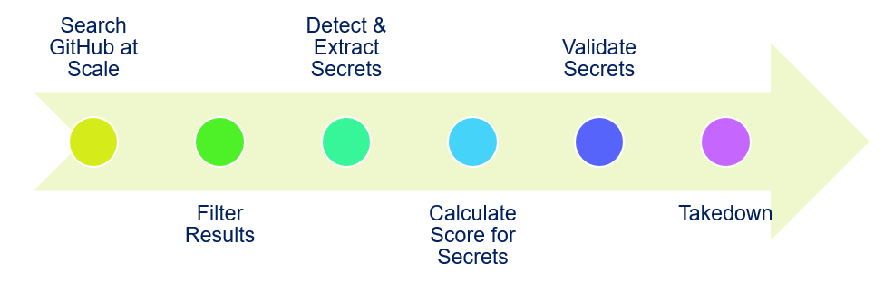
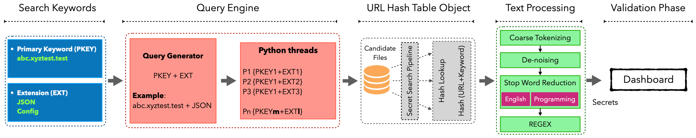

<h1 align="center"> xGitGuard </h1>

<p align="center">AI-Based Secrets Detection<br>
<i><b>Detect Secrets (API Tokens, Usernames, Passwords, etc.) Exposed on GitHub Repositories</b></i><br>
Designed and Developed by Comcast Cybersecurity Research and Development Team</p>

[](https://securityscorecards.dev/viewer/?uri=github.com/Comcast/xGitGuard)
[](https://opensource.org/licenses/Apache-2.0)
[](https://github.com/psf/black)

---

## Contents

- [Overview](#overview)
- [xGitGuard Workflow](#xgitguard-workflow)
- [Features](#features)
  - [Credential-Detection-Workflow](#credential-detection-workflow)
  - [Keys/Token-Detection-Workflow](#keystoken-detection-workflow)
- [Install](#install)
- [Search Patterns](#search-patterns)
- [Usage](#usage)
  - [Enterprise Github Secrets Detection](#enterprise-github-secrets-detection)
  - [Public Github Secrets Detection](#public-github-secrets-detection)
  - [ML Model Training](#ml-model-training)
  - [Custom Keyword Scan](#custom-keyword-scan)
- [License](#license)

## Overview

- **Detecting Publicly Exposed Secrets on GitHub at Scale**
  - xGitGuard is an AI-based system designed and developed by the Comcast Cybersecurity Research and Development team that detects secrets (e.g., API tokens, usernames, passwords, etc.) exposed on GitHub. xGitGuard uses advanced Natural Language Processing to detect secrets at scale and with appropriate velocity in GitHub repositories.
- What are Secrets?
  - **Credentials**
    - Usernames & passwords, server credentials, account credentials, etc.
  - **Keys/Tokens**
    - Service API tokens (AWS, Azure, etc), encryption keys, etc.

## xGitGuard Workflow



## Features

### Credential Detection Workflow

- [Enterprise Credential Secrets Detection](#enterprise-credential-secrets-detection) - Run Secret detection on the given `GitHub Enterprise` account
- [Public Credential Secrets Detection](#public-credential-secrets-detection) - Run Secret detection on the `GitHub Public` account

  

### Keys&Token Detection Workflow

- [Enterprise Keys and Tokens Secrets Detection](#enterprise-keys-and-tokens-secrets-detection) - Run Secret detection on the given `GitHub Enterprise` account
- [Public Keys and Tokens Secrets Detection](#public-keys-and-tokens-secrets-detection) - Run Secret detection on the `GitHub Public` account

  

## Install

### Environment Setup

- Install [Python >= v3.6]
- Clone/Download the repository from GitHub
- Traverse into the cloned `xGitGuard` folder

  ```
  cd xGitGuard
  ```

- Install Python Dependency Packages

  ```
  python -m pip install -r requirements.txt
  ```

- Check for Outdated Packages

  ```
  pip list --outdated
  ```

## Search Patterns

- There are two ways to define configurations in xGitGuard

  - Config Files
  - Command Line Inputs

- For **`Enterprise`** Github Detection **`(Secondary Keyword + Extension)`** under config directory
  - Secondary Keyword: secondary_keys.csv file or User Feed - list of Keys & Tokens
  - Secondary Keyword: secondary_creds.csv file or User Feed - list of Credentials
  - Extension: extensions.csv file or User Feed - List of file Extensions
- For **`Public`** Github Detection **`(Primary Keyword + Secondary Keyword + Extension)`** under config directory

  - Primary Keyword: primary_keywords.csv file or User Feed - list of primary Keys
  - Secondary Keyword: secondary_keys.csv file or User Feed - list of Keys & Toekns
  - Secondary Keyword: secondary_creds.csv file or User Feed - list of Credentials
  - Extension: extensions.csv file or User Feed - List of file Extensions

## Usage

- [Enterprise Github Secrets Detection](#enterprise-github-secrets-detection)
  - [Enterprise Credential Secrets Detection](#enterprise-credential-secrets-detection)
  - [Enterprise Keys and Tokens Secrets Detection](#enterprise-keys-and-tokens-secrets-detection)
- [Public Github Secrets Detection](#public-github-secrets-detection)
  - [Public Credential Secrets Detection](#public-credential-secrets-detection)
  - [Public Keys and Tokens Secrets Detection](#public-keys-and-tokens-secrets-detection)

### Enterprise Github Secrets Detection

#### API Configuration Setup

- Setup the system Environment variable below for accessing GitHub
  - **`GITHUB_ENTERPRISE_TOKEN`** - Enterprise GitHub API Token with full scopes of repository and user.
    - Refer to the GitHub documentation [How To Get GitHub API Token] for help
- Update the following configs with `your Enterprise Name` in config file **`xgg_configs.yaml`** in config Data folder **`xgitguard\config\*`**
  - enterprise_api_url: `https://github.<<`**`Enterprise_Name`**`>>.com/api/v3/search/code`
  - enterprise_pre_url: `https://github.<<`**`Enterprise_Name`**`>>.com/api/v3/repos/`
  - url_validator: `https://github.<<`**`Enterprise_Name`**`>>.com/api/v3/search/code`
  - enterprise_commits_url: `https://github.<<`**`Enterprise_Name`**`>>.com/api/v3/repos/{user_name}/{repo_name}/commits?path={file_path}`

#### Running Enterprise Secret Detection

- Traverse into the `github-enterprise` script folder

  ```
  cd github-enterprise
  ```

#### Enterprise Credential Secrets Detection

##### Detections Without Additional ML Filter

By default, the Credential Secrets Detection script runs for given Secondary Keywords and extensions without ML Filter.

```
# Run with Default configs
python enterprise_cred_detections.py
```

##### Detection With ML Filter

xGitGuard also has an additional ML filter where users can collect their organization/targeted data and train their model. Having this ML filter helps to reduce the false positives from the detection.

##### Pre-Requisite To Use the ML Filter

User Needs to follow the below process to collect data and train the model to use ML filter.

- Follow [ML Model Training](#ml-model-training)

> **NOTE** :
>
> - To use ML Filter, ML training is mandatory. This includes data collection, feature engineering & model persisting.
> - This process is going to be based on user requirements. It can be one time or if the user needs to improve the data, then needs to be done periodically.

##### Command to Run Enterprise Credential Scanner with ML

```
# Run for given Secondary Keyword and extension with ML model,
python enterprise_cred_detections.py -m Yes
```

##### Command to Run Enterprise Credentials Scanner for targeted organization

```
# Run for targeted org,
python enterprise_cred_detections.py -o org_name        #Ex: python enterprise_cred_detections.py -o test_org
```

##### Command to Run Enterprise Credentials Scanner for targeted repo

```
# Run for targeted repo,
python enterprise_cred_detections.py -r org_name/repo_name     #Ex: python enterprise_cred_detections.py -r test_org/public_docker
```

##### Command-Line Arguments for Credential Scanner

```
Run usage:
enterprise_cred_detections.py [-h] [-s Secondary Keywords] [-e Extensions] [-m Ml prediction] [-u Unmask Secret] [-o org_name] [-r repo_name] [-l Logger Level] [-c Console Logging]

optional arguments:
  -h, --help            show this help message and exit
  -s Secondary Keywords, --secondary_keywords Secondary Keywords
                          Pass the Secondary Keywords list as a comma-separated string
  -e Extensions, --extensions Extensions
                          Pass the Extensions list as a comma-separated string
  -m ML Prediction, --ml_prediction ML Prediction
                          Pass the ML Filter as Yes or No. Default is No
  -u Set Unmask, --unmask_secret To write secret unmasked, then set Yes
                          Pass the flag as Yes or No. Default is No
  -o pass org name, --org Pass the targeted org list as a comma-separated string
  -r pass repo name, --repo Pass the targeted repo list as a comma-separated string
  -l Logger Level, --log_level Logger Level
                          Pass the Logging level as for CRITICAL - 50, ERROR - 40 WARNING - 30 INFO - 20 DEBUG - 10. Default is 20
  -c Console Logging, --console_logging Console Logging
                          Pass the Console Logging as Yes or No. Default is Yes
```

- Inputs used for search and scan

  > **Note:** Command-line argument keywords have precedence over config files (Default). If no keywords are passed in cli, data from config files will be used for the search.

  - secondary_creds.csv file has a default list of credential relevant patterns for search, which can be updated by users based on their requirement.
  - extensions.csv file has a default list of file extensions to be searched, which can be updated by the users based on their requirement.

- GitHub search pattern for above examples: **`password +extension:py`**

#### Enterprise Keys and Tokens Secrets Detection

##### Detections Without Additional ML Filter

By default, the Keys and Tokens Secrets Detection script runs for given Secondary Keywords and the extensions without ML Filter.

```
# Run with Default configs
python enterprise_key_detections.py
```

##### Command to Run Enterprise Keys and Tokens Scanner for targeted organization

```
# Run for targeted org,
python enterprise_key_detections.py -o org_name        #Ex: python enterprise_key_detections.py -o test_org
```

##### Command to Run Enterprise Keys and Tokens Scanner for targeted repo

```
# Run for targeted repo,
python enterprise_key_detections.py -r org_name/repo_name     #Ex: python enterprise_key_detections.py -r test_org/public_docker
```

##### Detections With ML Filter

xGitGuard also has an additional ML filter where users can collect their organization/targeted data and train their model. Having this ML filter helps in reducing the false positives from the detection.

##### Pre-Requisite To Use ML Feature

The user needs to follow the below process to collect data and train the model to use ML filter.

- Follow [ML Model Training](#ml-model-training)

> **NOTE** :
>
> - To use ML filter, ML training is mandatory. It includes data collection, feature engineering & model persisting.
> - This process is going to be based on user requirements. It can be one time or if the user needs to improve the data, then it needs to be done periodically.

##### Command to Run Enterprise Keys & Token Scanner with ML

```
# Run for given Secondary Keyword and extension with ML model
python enterprise_key_detections.py -m Yes
```

##### Command-Line Arguments for Keys & Token Scanner

```
Run usage:
enterprise_key_detections.py [-h] [-s Secondary Keywords] [-e Extensions] [-m Ml prediction] [-u Unmask Secret] [-o org_name] [-r repo_name] [-l Logger Level] [-c Console Logging]

optional arguments:
  -h, --help            show this help message and exit
  -s Secondary Keywords, --secondary_keywords Secondary Keywords
                          Pass the Secondary Keywords list as a comma-separated string
  -e Extensions, --extensions Extensions
                          Pass the Extensions list as a comma-separated string
  -m ML Prediction, --ml_prediction ML Prediction
                          Pass the ML Filter as Yes or No. Default is No
  -u Set Unmask, --unmask_secret To write secret unmasked, then set Yes
                          Pass the flag as Yes or No. Default is No
  -o pass org name, --org Pass the targeted org list as a comma-separated string
  -r pass repo name, --repo Pass the targeted repo list as a comma-separated string
  -l Logger Level, --log_level Logger Level
                          Pass the Logging level as for CRITICAL - 50, ERROR - 40 WARNING - 30 INFO - 20 DEBUG - 10. Default is 20
  -c Console Logging, --console_logging Console Logging
                          Pass the Console Logging as Yes or No. Default is Yes
```

- Inputs used for search and scan

  > **Note:** Command-line argument keywords have precedence over config files (Default). If no keywords are passed in cli, data from the config files will be used for search.

  - secondary_keys.csv file will have a default list of key relevant patterns for search, which can be updated by the users based on their requirement.
  - extensions.csv file has a default list of file extensions to be searched, which can be updated by the users based on their requirement.

- GitHub search pattern for above examples: **`api_key +extension:py`**

#### Enterprise Output Format:

##### Output Files

- **Credentials**

  ```
    1. Hashed Url Files: xgitguard\output\*_enterprise_hashed_url_creds.csv
        - List previously Processed Search urls. Urls stored will be skipped in next run to avoid re processing.
    2. Secrets Detected: xgitguard\output\*_xgg_enterprise_creds_detected.csv
    3. Log File: xgitguard\logs\enterprise_key_detections_*yyyymmdd_hhmmss*.log
  ```

- **Keys & Tokens**

  ```
    1. Hashed Url Files: xgitguard\output\*_enterprise_hashed_url_keys.csv
        - List previously Processed Search urls. Urls stored will be skipped in next run to avoid re processing.
    2. Secrets Detected: xgitguard\output\*_xgg_enterprise_keys_detected.csv
    3. Log File: xgitguard\logs\enterprise_key_detections_*yyyymmdd_hhmmss*.log
  ```

### Public Github Secrets Detection

#### Configuration Data Setup

- Setup the Environment variable below for accessing GitHub
  - **`GITHUB_TOKEN`** - Public GitHub API Token with full scopes of the repository and user.
    - Refer to GitHub Docs [How To Get GitHub API Token] for help
- Config data folder **`xgitguard\config\*`**

#### Running Public Credential Secrets Detection

- Traverse into the `github-public` script folder
  ```
  cd github-public
  ```

> **Note:** User needs to remove the sample content from primary_keywords.csv and add primary keywords like targeted domain names to be searched in public GitHub.

#### Public Credential Secrets Detection

##### Detections Without Additional ML Filter

By default, Credential Secrets Detection script runs for given Primary Keyword, Secondary Keyword, and extension without ML Filter.

```
# Run with Default configs
python public_cred_detections.py
```

##### Command to Run Public Credential Scanner for targeted organization

```
# Run for targeted org,
python public_cred_detections.py -o org_name         #Ex: python public_cred_detections.py -o test_org
```

##### Command to Run Public Credential Scanner for targeted repo

```
# Run for targeted repo,
python public_cred_detections.py -r org_name/repo_name        #Ex: python public_cred_detections.py -r test_org/public_docker
```

##### Detections With ML Filter

xGitGuard also has an additional ML filter, where users can collect their organization/targeted data and train their model. Having this ML filter helps in reducing the false positives from the detection.

##### Pre-Requisite To Use ML Feature

The user needs to follow the below process to collect data and train the model to use ML filter.

- Follow [ML Model Training](#ml-model-training)

> **NOTE** :
>
> - To use ML Feature, ML training is mandatory. It includes data collection, feature engineering & model persisting.

##### Command to Run Public Credential Scanner with ML

```
# Run for given Primary Keyword, Secondary Keyword, and extension with ML model
python public_cred_detections.py -m Yes
```

##### Command-Line Arguments for Public Credential Scanner

```
Run usage:
usage: public_cred_detections.py [-h] [-p Primary Keywords] [-s Secondary Keywords] [-e Extensions] [-m Ml prediction] [-u Unmask Secret] [-o org_name] [-r repo_name] [-l Logger Level] [-c Console Logging]

optional arguments:
-h, --help show this help message and exit
-p Primary Keywords, --primary_keywords Primary Keywords
Pass the Primary Keywords list as a comma-separated string
-s Secondary Keywords, --secondary_keywords Secondary Keywords
Pass the Secondary Keywords list as a comma-separated string
-e Extensions, --extensions Extensions
Pass the Extensions list as a comma-separated string
-m ML Prediction, --ml_prediction ML Prediction
                          Pass the ML Filter as Yes or No. Default is No
-u Set Unmask, --unmask_secret To write secret unmasked, then set Yes
                          Pass the flag as Yes or No. Default is No
-o pass org name, --org Pass the targeted org list as a comma-separated string
-r pass repo name, --repo Pass the targeted repo list as a comma-separated string
-l Logger Level, --log_level Logger Level
Pass the Logging level as for CRITICAL - 50, ERROR - 40 WARNING - 30 INFO - 20 DEBUG - 10. Default is 20
-c Console Logging, --console_logging Console Logging
Pass the Console Logging as Yes or No. Default is Yes
```

- Inputs used for search and scan

  > **Note:**
  > Command line argument keywords have precedence over config files (Default).
  > If no keywords are passed in cli, config files data will be used for search.

  - primary_keywords.csv file will have a default list of primary keyword-relevant patterns for search
  - secondary_creds.csv file will have a default list of credential relevant patterns for search, which can be updated by the users based on their requirement.
  - extensions.csv file has a default list of file extensions to be searched, which can be updated by the users based on their requirement.

- GitHub search pattern for above examples: **`abc.xyz.com password +extension:py`**

##### Public Keys and Tokens Secrets Detection

##### Detections Without Additional ML Filter

By default, Keys and Tokens Secret Detection script runs for given Primary Keyword, Secondary Keyword and extension without ML Filter.

```
# Run with Default configs
python public_key_detections.py
```

##### Command to Run Public Keys and Tokens Scanner for targeted organization

```
# Run  for targeted org,
python public_key_detections.py -o org_name           #Ex: python public_key_detections.py -o test_org
```

##### Command to Run Public Keys and Tokens Scanner for targeted repo

```
# Run for targeted repo,
python public_key_detections.py -r org_name/repo_name      #Ex: python public_key_detections.py -r test_org/public_docker
```

##### Detections With ML Filter

xGitGuard also has an additional ML filter, where users can collect their organization/targeted data and train their model. Having this ML filter helps in reducing the false positives from the detection.

##### Pre-Requisite To Use ML Feature

The user needs to follow the below process to collect data and train the model to use ML filter.

- Follow [ML Model Training](#ml-model-training)

> **NOTE** :
> To use ML Feature, ML training is mandatory. It includes data collection,feature engineering & model persisting.

##### Command to Run Public Keys & Tokens Secret Scanner with ML

```
# Run for given  Primary Keyword, Secondary Keyword, and extension with ML model,
python public_key_detections.py -m Yes
```

##### Command-Line Arguments for Public Keys & Tokens Secret Scanner

```
usage:
public_key_detections.py [-h] [-s Secondary Keywords] [-e Extensions] [-m Ml prediction][-u Unmask Secret] [-o org_name] [-r repo_name] [-l Logger Level] [-c Console Logging]

optional arguments:
-h, --help show this help message and exit
-s Secondary Keywords, --secondary_keywords Secondary Keywords
Pass the Secondary Keywords list as a comma-separated string
-e Extensions, --extensions Extensions
Pass the Extensions list as a comma-separated string
-m ML Prediction, --ml_prediction ML Prediction
                          Pass the ML Filter as Yes or No. Default is No
-u Set Unmask, --unmask_secret To write secret unmasked, then set Yes
                          Pass the flag as Yes or No. Default is No
-o pass org name, --org Pass the targeted org list as a comma-separated string
-r pass repo name, --repo Pass the targeted repo list as a comma-separated string
-l Logger Level, --log_level Logger Level
Pass the Logging level as for CRITICAL - 50, ERROR - 40 WARNING - 30 INFO - 20 DEBUG - 10. Default is 20
-c Console Logging, --console_logging Console Logging
Pass the Console Logging as Yes or No. Default is Yes
```

- Inputs used for search and scan

  > **Note:**
  > Command line argument keywords have precedence over config files (Default).
  > If no keywords are passed in cli, config files data will be used for search.

  - primary_keywords.csv file will have a default list of primary keyword-relevant patterns for search, which can be updated by the users based on their requirement.
  - secondary_keys.csv file will have a default list of tokens & keys relevant patterns for search, which can be updated by the users based on their requirement.
  - extensions.csv file has a default list of file extensions to be searched, which can be updated by the users based on their requirement.

- GitHub search pattern for above examples: **`abc.xyz.com api_key +extension:py`**

##### Public Output Files

- **Credentials**

  ```
    1. Hashed Url Files: xgitguard\output\*_public_hashed_url_creds.csv
        - List pf previously Processed Search urls. Urls stored will be skipped in next run to avoid re processing.
    2. Secrets Detected: xgitguard\output\*_xgg_public_creds_detected.csv
    3. Log File: xgitguard\logs\public_key_detections_*yyyymmdd_hhmmss*.log
  ```

- **Keys & Tokens**

  ```
    1. Hashed Url Files: xgitguard\output\*_public_hashed_url_keys.csv
        - List pf previously Processed Search urls. Urls stored will be skipped in next run to avoid re processing.
    2. Secrets Detected: xgitguard\output\*_xgg_public_keys_detected.csv
    3. Log File: xgitguard\logs\public_key_detections_*yyyymmdd_hhmmss*.log
  ```

> **Note:** By Default, the detected secrets will be masked to hide sensitive data. If needed, user can skip the masking to write raw secret using command line argument `-u Yes or --unmask_secret Yes`. Refer command line options for more details.

#### ML Model Training

#### Enterprise ML Model Training Procedure

To use ML Feature, ML training is mandatory. It includes data collection, feature engineering & model persisting.

> **Note:** Labelling the collected secret is an important process to improve the ML prediction.

- Traverse into the "ml_training" folder

  ```
  cd ml_training
  ```

##### Data Collection

Traverse into the "data collector" folder under ml_training

```
  cd ml_data_collector\github-enterprise-ml-data-collector
```

- Credentials

  1. Run for given Secondary Keywords and extensions
     ```
     python enterprise_cred_data_collector.py
     ```
  2. To run with other parameters, please use help.
     ```
     python enterprise_cred_data_collector.py  -h
     ```
  3. Training data for Enterprise Creds collected will be placed in **`xgitguard\output\cred_train_source.csv`** folder

- Keys & Tokens

  1. Run for given Secondary Keywords and extensions,
     ```
     python enterprise_key_data_collector.py
     ```
  2. To run with other parameters, please use help.
     ```
     python enterprise_key_data_collector.py  -h
     ```
  3. Training data for Enterprise Keys and Tokens collected will be placed in **`xgitguard\output\key_train_source.csv`** folder

##### Review & Label the Collected Data

1. By default all the data collected will be labeled as 1 under column "Label" in collected training data indicating the collected secret as a valid one.
2. **`User needs to review each row in the collected data and update the label value.`**
   **`i.e: if the user thinks collected data is not a secret, then change the value to 0 for that particular row.`**
3. By doing this, ML will have quality data for the model to reduce false positives.

##### Feature Engineering

Traverse into the "ml_training" folder

- Credentials

  1.  Run with option cred for engineering collected cred data
      ```
      python ml_feature_engineering.py cred
      ```
  2.  By default in Enterprise mode, input will be cred_train_source.csv
  3.  Engineered data for Enterprise Creds output will be placed in **`xgitguard\output\cred_train.csv`** folder

- Keys & Tokens
  1. Run with option cred for engineering collected keys & tokens data
     ```
     python ml_feature_engineering.py key
     ```
  2. By default in Enterprise mode, input will be key_train_source.csv
  3. Engineered data for Enterprise Keys & Tokens output will be placed in **`xgitguard\output\key_train.csv`** folder

##### ML Model Creation for Enterprise

Traverse into the "ml_training" folder

- Run training with Cred Training Data and persist model

  ```
  python model.py cred
  ```

- Run training with Key Training Data and persist model

  ```
  python model.py key
  ```

- For help on command line arguments, run
  ```
  python model.py  -h
  ```
  > **Note:** If persisted model **xgitguard\output\xgg\_\*.pickle** is not present in the output folder, then use engineered data to create a model and persist it.

#### Public GitHub ML Model Training Procedure

To use ML Feature, ML training is mandatory. It includes data collection, feature engineering & model persisting.

> **Note:** Labelling the collected secret is an important process to use the ML effectively.

- Traverse into the "models" folder

  ```
  cd ml_training
  ```

##### Data Collection :

Traverse into the "data collector" folder

```
cd ml_training\ml_data_collector\github-public-ml-data-collector
```

> **Note:** User needs to remove the sample content from primary_keywords.csv and add primary keywords like targeted domain names to be searched in public GitHub.

- Credentials

  1. Run for given Primary Keywords, Secondary Keywords, and extensions
     ```
     python public_cred_data_collector.py
     ```
  2. To run with other parameters, please use help.
     ```
     python public_cred_data_collector.py -h
     ```
  3. Training data for Public Creds collected will be placed in **`xgitguard\output\public_cred_train_source.csv`** folder

- Keys & Tokens

  1. Run for given Primary Keywords, Secondary keywords, and extensions
     ```
     python public_key_data_collector.py
     ```
  2. To run with other parameters, please use help.
     ```
     python public_key_data_collector.py  -h
     ```
  3. Training data for Public Keys and Tokens collected will be placed in **`xgitguard\output\public_key_train_source.csv`** folder

> **Note:** The data collection for public GitHub is optional.
>
> - If targeted data collected from Enterprise is enough to use, then we can skip the data collection & Label review process

##### Review & Label the Collected Data:

1. By default, all the data collected will be labeled as 1 under column "Label" in collected training data indicating the collected secret as a valid one.
2. **`User needs to review each row in the collected data and update the label value.`**
   **`i.e: if the user thinks collected data is not a secret, then change the value to 0 for that particular row.`**
3. By doing this, ML will have quality data for the model to reduce false positives.

> **Note:** Labelling the collected secret is an important process to use the ML effectively.

##### Feature Engineering

Traverse into the "ml_training" folder

- Credentials

  1.  Run with option cred for engineering collected cred data with public source data.
      ```
      python ml_feature_engineering.py cred -s public
      ```
  2.  In public mode, input will be public_cred_train_source.csv
  3.  Engineered data for Public Creds output will be placed in **`xgitguard\output\public_cred_train.csv`** folder

- Keys & Tokens

  1.  Run with option cred for engineering collected keys & tokens data with public source data.
      ```
      python ml_feature_engineering.py key -s public
      ```
  2.  In public mode, input will be public_key_train_source.csv
  3.  Engineered data for Public Keys & Tokens output will be placed in **`xgitguard\output\public_key_train.csv`** folder

> **Note:**
>
> - Data collection & feature engineering for public GitHub scan is optional.
> - When public training data not available, feature engineering will use enterprise source data.

##### ML Model Creation for Public GitHub

Traverse into the "ml_training" folder

- Run training with Cred Training Data and persist model with public source data

  ```
  python model.py cred -s public
  ```

- Run training with Key Training Data and persist model with public source data

  ```
  python model.py key -s public
  ```

- For help on command line arguments, run
  ```
  python model.py  -h
  ```
  > **Note:**
  >
  > - If persisted model **xgitguard\output\public\_\*xgg\*.pickle** is not present in the output folder, then use feature engineered data to create a model and persist it.
  > - By default, when feature engineered data collected in Public mode not available, then model creation will be using enterprise-based engineered data.

## Custom Keyword Scan

- Traverse into the `custom-keyword-search` script folder

  ```
  cd custom-keyword-search
  ```

#### Running Enterprise Keyword Search

#### Enterprise Custom Keyword Search Process

Please add the required keywords to be searched into config/enterprise_keywords.csv

```
# Run with given configs,
python enterprise_keyword_search.py
```

##### Command to Run Enterprise Scanner for targeted organization

```
# Run Run for targeted org,
python enterprise_keyword_search.py -o org_name             #Ex: python enterprise_keyword_search.py -o test_ccs
```

##### Command to Run Enterprise Scanner for targeted repo

```
# Run Run for targeted repo,
python enterprise_keyword_search.py -r org_name/repo_name         #Ex: python enterprise_keyword_search.py -r test_ccs/ccs_repo_1
```

##### Command-Line Arguments for Enterprise keyword Scanner

```
Run usage:
enterprise_keyword_search.py [-h] [-e Enterprise Keywords]  [-o org_name] [-r repo_name] [-l Logger Level] [-c Console Logging]

optional arguments:
  -h, --help            show this help message and exit
  -e Enterprise Keywords, --enterprise_keywords Enterprise Keywords
                          Pass the Enterprise Keywords list as a comma-separated string.This is optional argument. Keywords can also be provided in the `enterprise_keywords.csv` file located in the `configs` directory.
  -o pass org name, --org Pass the targeted org list as a comma-separated string
  -r pass repo name, --repo Pass the targeted repo list as a comma-separated string
  -l Logger Level, --log_level Logger Level
                          Pass the Logging level as for CRITICAL - 50, ERROR - 40 WARNING - 30 INFO - 20 DEBUG - 10. Default is 20
  -c Console Logging, --console_logging Console Logging
                          Pass the Console Logging as Yes or No. Default is Yes
```

#### Running Public Keyword Search

#### Public Custom Keyword Search Process

Please add the required keywords to be searched into config/public_keywords.csv

```
# Run with given configs,
python public_keyword_search.py
```

##### Command to Run Public Scanner for targeted organization

```
# Run Run for targeted org,
python public_keyword_search.py -o org_name                 #Ex: python public_keyword_search.py -o test_org
```

##### Command to Run Public Scanner for targeted repo

```
# Run Run for targeted repo,
python public_keyword_search.py -r org_name/repo_name         #Ex: python public_keyword_search.py -r test_org/public_docker
```

##### Command-Line Arguments for Public keyword Scanner

```
Run usage:
public_keyword_search.py [-h] [-p Public Keywords]  [-o org_name] [-r repo_name] [-l Logger Level] [-c Console Logging]

optional arguments:
  -h, --help            show this help message and exit
  -e Public Keywords, --public_keywords Public Keywords
                          Pass the Public Keywords list as a comma-separated string.This is optional argument. Keywords can also be provided in the `public_keywords.csv` file located in the `configs` directory.
  -o pass org name, --org Pass the targeted org list as a comma-separated string
  -r pass repo name, --repo Pass the targeted repo list as a comma-separated string
  -l Logger Level, --log_level Logger Level
                          Pass the Logging level as for CRITICAL - 50, ERROR - 40 WARNING - 30 INFO - 20 DEBUG - 10. Default is 20
  -c Console Logging, --console_logging Console Logging
                          Pass the Console Logging as Yes or No. Default is Yes
```

### Additional Important Notes

- Users can update confidence_values.csv based on secondary_keys, secondary_creds, extensions value and give scoring from level 0 (lowest) to 5 (highest) to denote associated keyword suspiciousness.
- If users need to add any custom/new secondary creds/keys or extensions to the config files, then the same has to be added in the confidence_values.csv file with respective score level.
- Stop Words provided in config files are very limited and generic.Users need to update stop_words.csv with keywords considered has false postives to filter it out from the detections.
- Users can add additional extensions to extensions.csv to search types of files other than the default list.
- Users can enhance secondary_creds.csv/secondary_keys.csv by adding new patterns to do searches other than the default list.
- Users need to add primary keywords for public search in primary_keywords.csv after removing the sample content.
- In case of GitHub API calls resulting in 403 due to API rate-limit, increase the throttle timeout (github.throttle_time: 10) in the config ("config/xgg_configs.yaml)".

## License

Licensed under the [Apache 2.0](LICENSE) license.

[python >= v3.6]: https://www.python.org/downloads/
[how to get github api token]: https://docs.github.com/en/github/authenticating-to-github/keeping-your-account-and-data-secure/creating-a-personal-access-token
